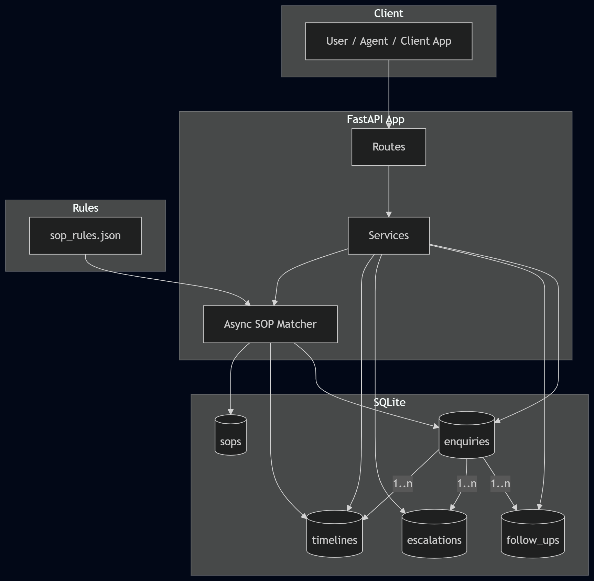

## Overview

FastAPI backend for a multi-channel enquiry management system.
It handles customer enquiry ingestion, **async SOP keyword matching**, suggested responses, follow-ups, escalations, and a full state-change timeline.

```
POST /api/v1/enquiry              Create a new enquiry (+ fire async SOP task)
POST /api/v1/enquiry/{id}/follow-up  Add a follow-up note
POST /api/v1/enquiry/{id}/escalate   Escalate an enquiry
GET  /api/v1/enquiry/{id}/history    Enquiry + full timeline
GET  /api/v1/health              Health check
```

---

## Architecture



```
app/
├── api/           FastAPI routers & dependency injection
├── core/          Config, logging, security middleware
├── db/            SQLAlchemy engine, session, ORM models
├── schemas/       Pydantic request/response schemas
├── services/      Business logic layer
├── repositories/  Data-access layer (repository pattern)
├── workers/       Async background tasks (SOP matcher)
└── main.py        FastAPI app factory & lifespan manager
```

### Key Design Decisions

| Layer        | Responsibility                                     |
|--------------|----------------------------------------------------|
| Routes       | HTTP shape, validation via Pydantic, DI injection |
| Services     | Business rules, orchestrates repositories          |
| Repositories | SQLAlchemy CRUD, query helpers                     |
| Workers      | Async processing — non-blocking SOP matching       |
| Schemas      | Typed contracts, serialization                     |

---

## Prerequisites

- Python **3.12**
- pip

---

## Setup

```bash
cd backend

# 1. Create a virtual environment
python -m venv .venv

# 2. Activate it
#   Windows:
.venv\Scripts\activate
#   macOS / Linux:
source .venv/bin/activate

# 3. Install dependencies
pip install -r requirements.txt

# 4. Copy the env file and (optionally) tweak values
copy .env.example .env

# 5. Run the server
uvicorn app.main:app --reload --host 0.0.0.0 --port 8000
```

The API docs are available at **http://localhost:8000/docs**

---

## Docker

```bash
# Build and run
docker-compose up --build

# Stop
docker-compose down
```

---

## Environment Variables

| Variable | Default | Description |
|---|---|---|
| `APP_NAME` | `Closira Enquiry API` | App display name |
| `APP_VERSION` | `1.0.0` | Semantic version |
| `DEBUG` | `True` | Toggle debug mode |
| `DB_URL` | `sqlite:///./data/closira.db` | SQLAlchemy DB URI |
| `DB_ECHO` | `False` | Echo SQL to stdout |
| `LOG_LEVEL` | `INFO` | Stdlib log level |
| `LOG_FORMAT` | `json` | `json` or `text` |
| `SOP_KEYWORDS_FILE` | `./data/sop_rules.json` | Path to SOP rules JSON |
| `MAX_CONVERSATION_HISTORY` | `50` | Max stored history entries |
| `ESCALATION_PRIORITY_MIN` | `3` | Min priority for auto-escalation |
| `CORS_ORIGINS` | `["*"]` | CORS allowed origins |

---

## Database Schema and Reasoning

SQLite is used for a lightweight, zero-config local prototype. The schema is normalized around a single enquiry with child records for follow-ups, escalations, and timeline events.

### Tables

- enquiries
  - id (UUID, PK)
  - customer_name, customer_email, phone, channel
  - subject, message
  - status, priority, sop_matched, suggested_response
  - conversation_history (JSON)
  - created_at, updated_at
- follow_ups
  - id (UUID, PK)
  - enquiry_id (FK -> enquiries.id)
  - notes, created_at
- escalations
  - id (UUID, PK)
  - enquiry_id (FK -> enquiries.id)
  - reason, assignee, priority, status
  - created_at, resolved_at
- timelines
  - id (UUID, PK)
  - enquiry_id (FK -> enquiries.id)
  - event, old_value, new_value, created_at
- sops
  - id (UUID, PK)
  - name (unique), keywords, response_template
  - priority, is_active, created_at

### Why this design

- Enquiry is the core aggregate; follow-ups, escalations, and timeline entries are one-to-many for auditability.
- Timeline is a separate table to preserve a full state-change trail without inflating the enquiry row.
- SOP rules are modeled separately so they can be stored in DB (or loaded from JSON) and evolved independently.

---

## Celery vs Background Tasks

This prototype uses an in-process async task (asyncio) for SOP matching rather than Celery.

### Decision

- Background tasks keep the stack simple for a single-node prototype and avoid extra infra (broker, worker processes).

### Trade-offs / Limitations

- No durable queue, retries, or task persistence if the process crashes.
- Limited scalability for high throughput; long tasks can block the event loop.
- Not suitable for distributed processing or guaranteed delivery.

If this were production, Celery (or a managed queue) would be the next step for durability and horizontal scaling.

---

## API Tests

Use the REST Client file to exercise all five endpoints with sample payloads:

- [backend/api-tests.http](backend/api-tests.http)

---

## Video Walkthrough (2–5 minutes)

- Add your walkthrough link here.

## API Endpoints

### `POST /api/v1/enquiry`
Create a new enquiry. Triggers async SOP matching in the background.

```json
{
  "customer_name": "Alice Johnson",
  "customer_email": "alice@example.com",
  "phone": "+1-555-0100",
  "channel": "email",
  "subject": "Refund request for order #1234",
  "message": "I would like to request a refund for my recent order.",
  "conversation_history": [
    {"role": "customer", "content": "I want a refund"},
    {"role": "agent",  "content": "Sure, can you share your order number?"}
  ]
}
```

### `POST /api/v1/enquiry/{id}/follow-up`
Add a follow-up note.

```json
{"notes": "Called customer — they confirmed the refund was received."}
```

### `POST /api/v1/enquiry/{id}/escalate`
Escalate an enquiry.

```json
{"reason": "Customer demanding immediate refund. No SOP covers this case.", "assignee": "agent-007", "priority": "high"}
```

### `GET /api/v1/enquiry/{id}/history`
Retrieve enquiry plus full timeline.

### `GET /api/v1/health`
Health check — returns `{"status": "healthy", "version": "1.0.0"}`.

---

## cURL Examples

```bash
# ── Create an enquiry ──────────────────────────────────────────────────────
curl -X POST http://localhost:8000/api/v1/enquiry \
  -H "Content-Type: application/json" \
  -d '{
    "customer_name": "Alice Johnson",
    "customer_email": "alice@example.com",
    "channel": "email",
    "subject": "Refund request for order #1234",
    "message": "I would like to request a refund for my recent order."
  }'

# ── Add follow-up ─────────────────────────────────────────────────────────
curl -X POST http://localhost:8000/api/v1/enquiry/<ENQUIRY_ID>/follow-up \
  -H "Content-Type: application/json" \
  -d '{"notes": "Called customer back — confirmed refund received."}'

# ── Escalate ───────────────────────────────────────────────────────────────
curl -X POST http://localhost:8000/api/v1/enquiry/<ENQUIRY_ID>/escalate \
  -H "Content-Type: application/json" \
  -d '{"reason": "Customer demanding immediate refund outside policy.", "priority": "high"}'

# ── Get history ───────────────────────────────────────────────────────────
curl http://localhost:8000/api/v1/enquiry/<ENQUIRY_ID>/history

# ── Health ────────────────────────────────────────────────────────────────
curl http://localhost:8000/api/v1/health
```

---

## Testing

```bash
# Unit tests (pytest)
pip install pytest
pytest tests/ -v

# Run with coverage
pip install pytest-cov
pytest tests/ --cov=app --cov-report=html
```

---

## SOP Matching Logic

The SOP matcher runs **asynchronously** after an enquiry is created (non-blocking).
It scores each rule by the number of exact keyword hits on the customer message and selects the rule with the **highest priority** (lowest number wins on tie).
If no keyword matches are found the system leaves the enquiry in status `processing` to signal that a human agent should review it.

---

## Project Structure

```
backend/
├── app/
│   ├── api/
│   │   ├── routes/
│   │   │   └── enquiry.py        ← HTTP handlers
│   │   └── dependencies/
│   ├── core/
│   │   ├── config.py             ← Pydantic Settings
│   │   ├── logging.py            ← Structured JSON logging
│   │   └── security.py           ← CORS & request audit middleware
│   ├── db/
│   │   ├── base.py               ← DeclarativeBase
│   │   ├── session.py            ← Engine + SessionLocal
│   │   └── models/               ← ORM entities
│   ├── schemas/                  ← Pydantic DTOs
│   ├── services/                 ← Business logic
│   ├── repositories/             ← Repository pattern
│   ├── workers/                  ← Background SOP matcher
│   └── main.py                   ← FastAPI app factory
├── data/                         ← SQLite DB + JSON files (gitignored)
├── tests/                        ← pytest test suite
├── requirements.txt
├── .env.example
├── Dockerfile
└── docker-compose.yml
```
